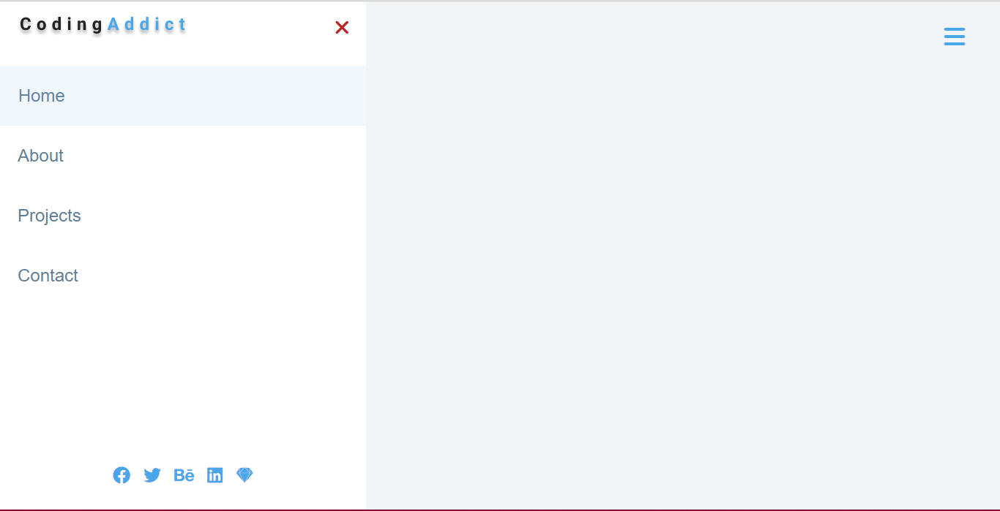
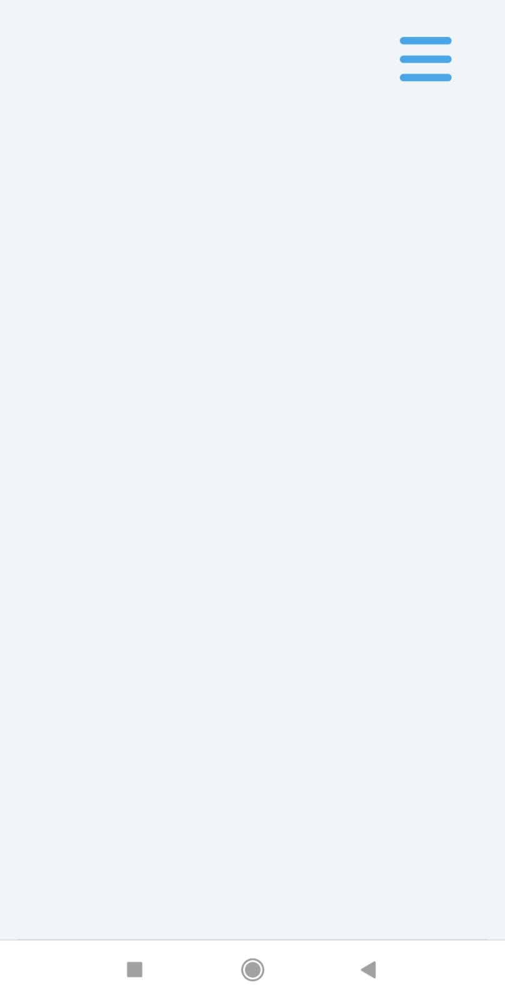
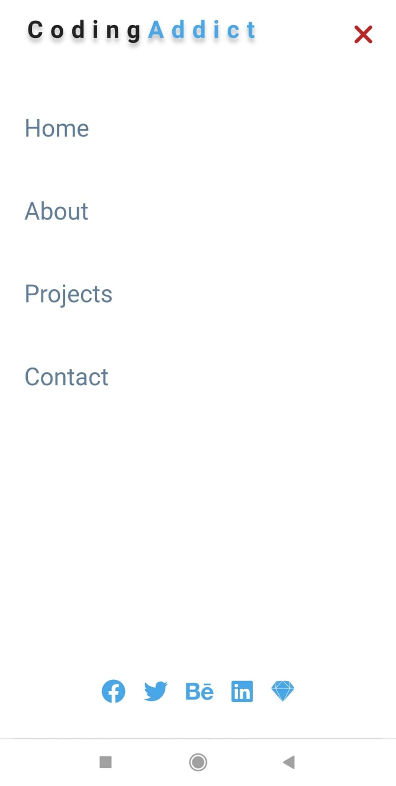

# Sidebar

>⚠️ Este projeto foi baseado na lista de projetos do Autor Daniel Rosa, publicado em seu Blog. Acesse [aqui](https://www.freecodecamp.org/portuguese/news/40-projetos-em-javascript-para-iniciantes-ideias-simples-para-comecar-a-programar-em-js/).

O Sidebar trata-se de um pequeno projeto, no qual tem a funcionalidade de ser um menu lateral animado.

Para desenvolvimento do projeto, foram utilizado as seguintes tecnologias:
- HTML5
- CSS3
- JavaScript

Para acessar o projeto em produção, [clique aqui.](https://gtm35.github.io/Sidebar/)

### Versão Desktop:

### Versão Mobile:

